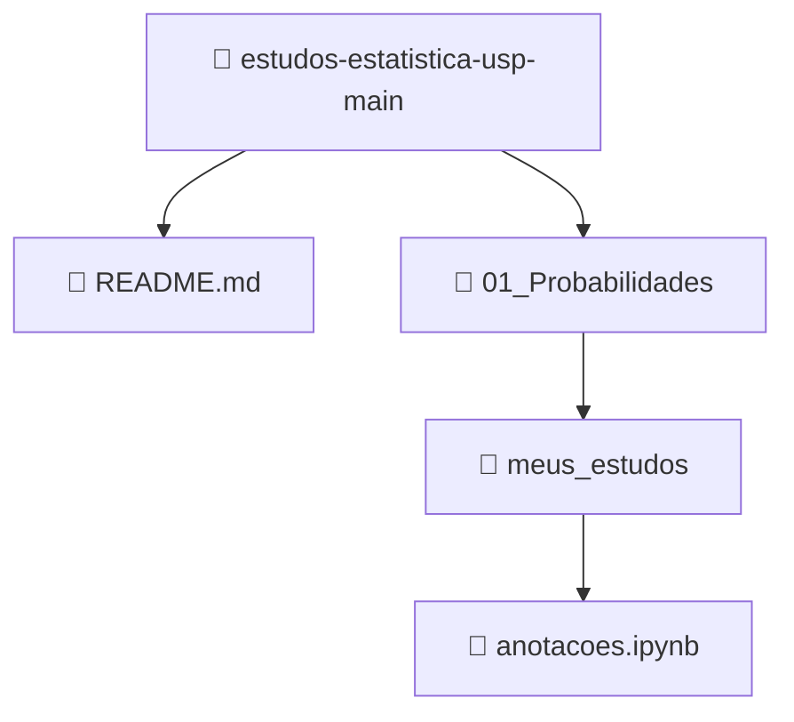

# 📊 Fundamentos de Probabilidade e Estatística para Ciência de Dados — 4ª Edição (USP)

**Status:** 🚧 Em andamento

Este repositório reúne resumos teóricos, anotações de estudo e códigos computacionais desenvolvidos durante as aulas da **4ª Edição** do curso de extensão _Fundamentos de Probabilidade e Estatística para Ciência de Dados_, promovido pelo ICMC-USP (Universidade de São Paulo).

O objetivo deste material é servir como fonte de consulta, revisão acadêmica e prática aplicada para estudantes e profissionais interessados em Ciência de Dados, Probabilidade e Estatística. Todo o conteúdo foi organizado para facilitar o acompanhamento das aulas, a fixação dos conceitos e a experimentação prática dos tópicos abordados no curso.

## 🛠️ Tecnologias e Bibliotecas Utilizadas
As simulações e cálculos estatísticos deste repositório utilizam o seguinte ecossistema:
- 🐍 **Linguagem:** Python 3
- 📓 **Ambiente Científico:** Jupyter Notebook (`.ipynb`)
- 🔢 **Manipulação Numérica e Probabilística:** NumPy
- 📈 **Visualização de Dados:** Matplotlib

## 📚 Como acessar as anotações e códigos
O material está estruturado em Jupyter Notebooks, combinando explicações teóricas, fórmulas matemáticas e simulações executáveis em Python. Você pode acessar de duas formas:

**👀 Leitura rápida pelo GitHub:**
- Navegue até a pasta desejada (ex: `01_Probabilidades/`) e clique no arquivo `.ipynb` (ex: `anotacoes.ipynb`). O próprio GitHub renderiza o notebook para leitura estática, sem necessidade de download.

**💻 Execução e edição local:**
1. Instale o [Python](https://www.python.org/downloads/) em sua máquina.
2. Instale as bibliotecas necessárias com: `pip install numpy matplotlib jupyter nbformat`
3. Baixe ou clone este repositório.
4. No terminal, acesse a pasta do repositório e execute: `jupyter notebook`
5. O navegador abrirá a interface do Jupyter. Acesse o arquivo `anotacoes.ipynb` para interagir, editar e executar os códigos conforme desejar.

## Sobre o curso e o docente
O conteúdo teórico deste repositório é baseado nas aulas do Prof. Dr. Francisco Rodrigues (ICMC-USP), pesquisador de destaque internacional nas áreas de Inteligência Artificial, Redes Complexas e Física. O curso é promovido pelo Instituto de Ciências Matemáticas e de Computação da USP.

## 🗂️ Estrutura do repositório

- 📁 **01_Probabilidades/**: Anotações sobre teoria dos conjuntos, axiomas de probabilidade, variáveis aleatórias e simulações dos conceitos frequentista e clássico.

---

> Este repositório é um projeto pessoal e não possui vínculo institucional oficial com a USP, mas segue fielmente o conteúdo ministrado no curso.
